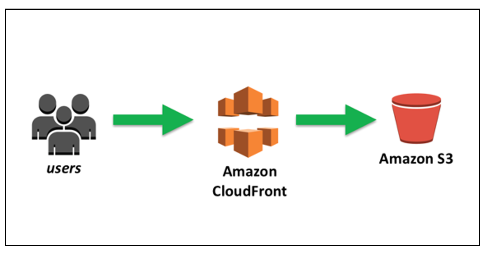
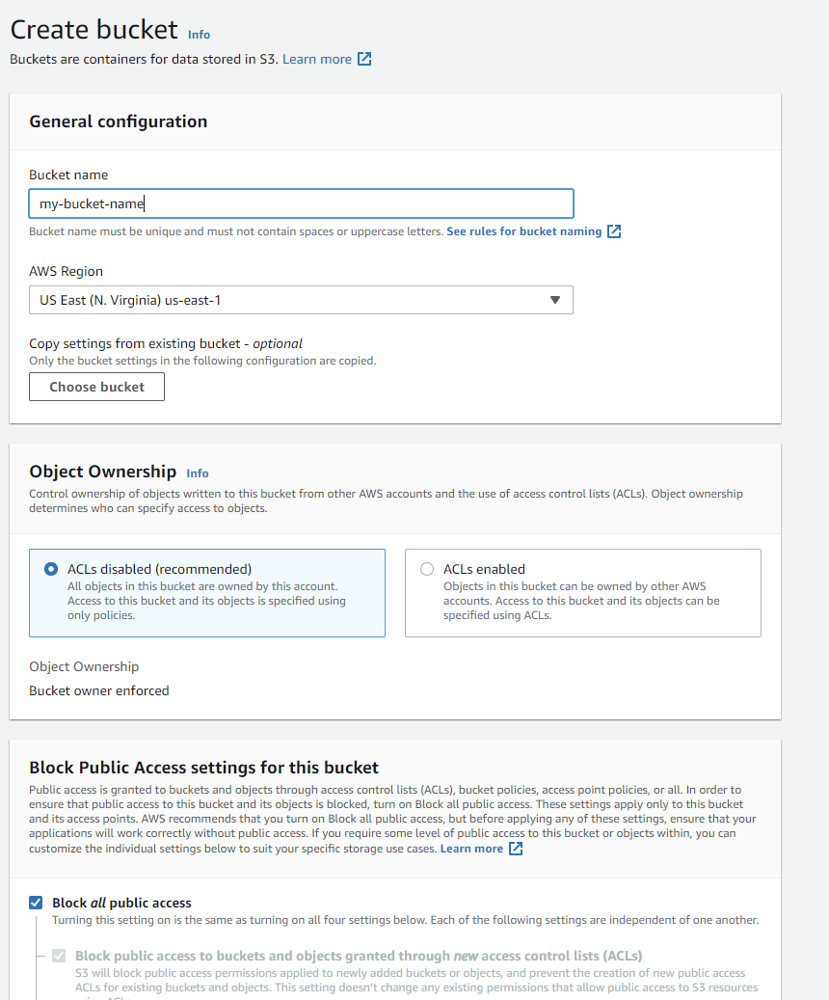
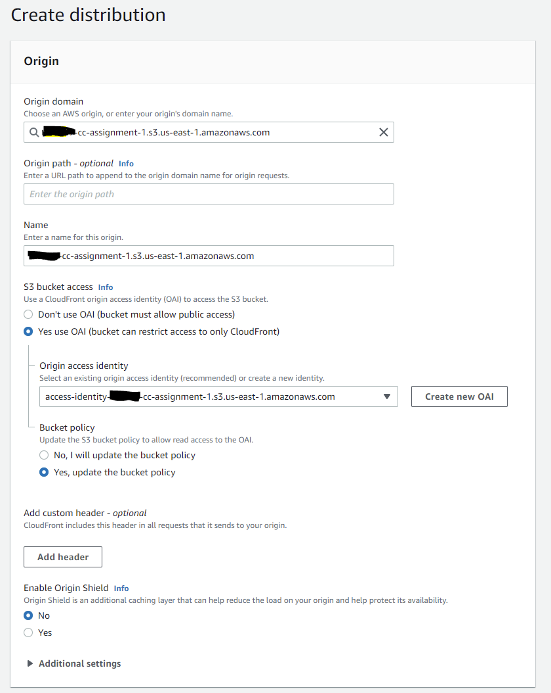
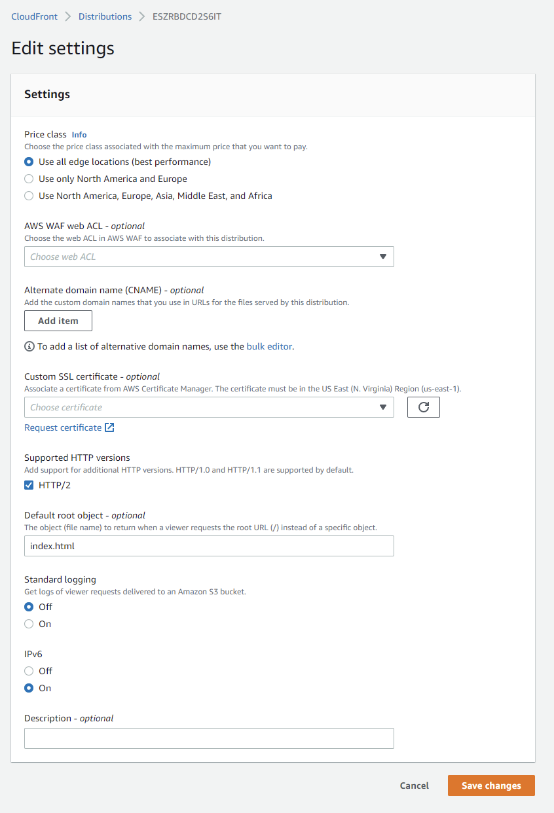
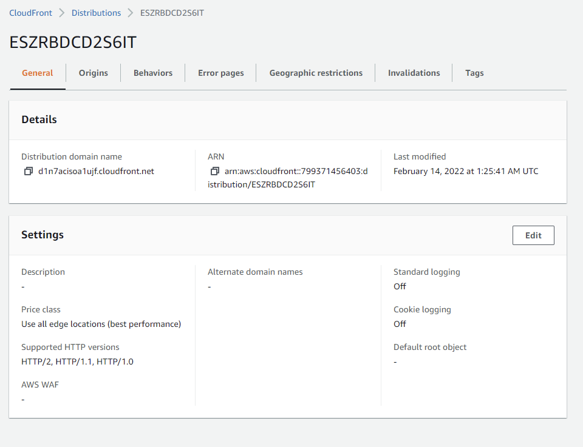
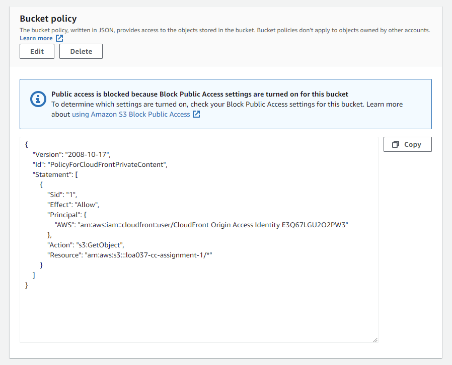

# Assignment-1-CC-

This repository contains the setup instructions for Assignment 1 as well as the source code for the website deployed on S3 and CloudFront.

[Link to Website](https://d1n7acisoa1ujf.cloudfront.net/)

## Design

### Architecture

The architecture of this setup is relatively simple as it uses an Amazon CloudFront distribution for fast delviery to clients. Having CloudFront backed by a private S3 bucket gives us a data source to store the website in a secure manner. CloudFront also gives us an SSL certificate and URL to publicly access the data without public access to the S3 bucket.

## Setup

Prerequisites: An AWS Account

- [Create S3 Bucket](https://s3.console.aws.amazon.com/s3/bucket/create?region=us-east-1)
  
  - Bucket name must be globally unique
  - ACLs should be disabled
  - Block all public access should be enabled
- [Create CloudFront Distribution](https://console.aws.amazon.com/cloudfront/v3/home?region=us-east-1#/distributions/create)
  
  - Use the S3 bucket created in the step above as the origin
  - Use OAI to enable secure access to private bucket
  - Check the box for "Yes, update the bucket policy" to ensure Cloudfront can access it
- Modify Default root object to index.html
  
  - Edit the distribution to view this page
- Verify CloudFront Status
  
  - Refresh and wait until the status is not "Deploying"
- Verify S3 Bucket Policy
  
  - Obtained by navigating to bucket
  - Click on the permissions tab
- Access public CloudFront url from distribution status page